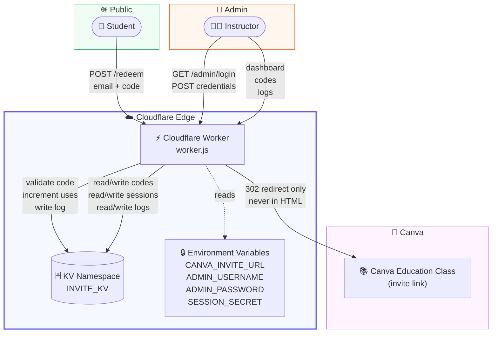
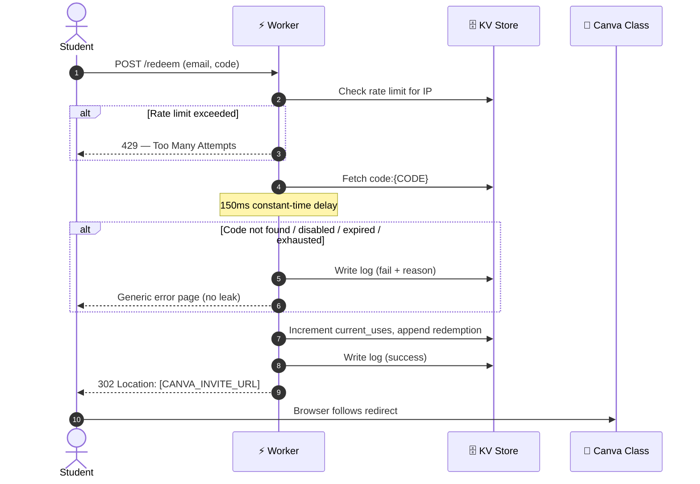
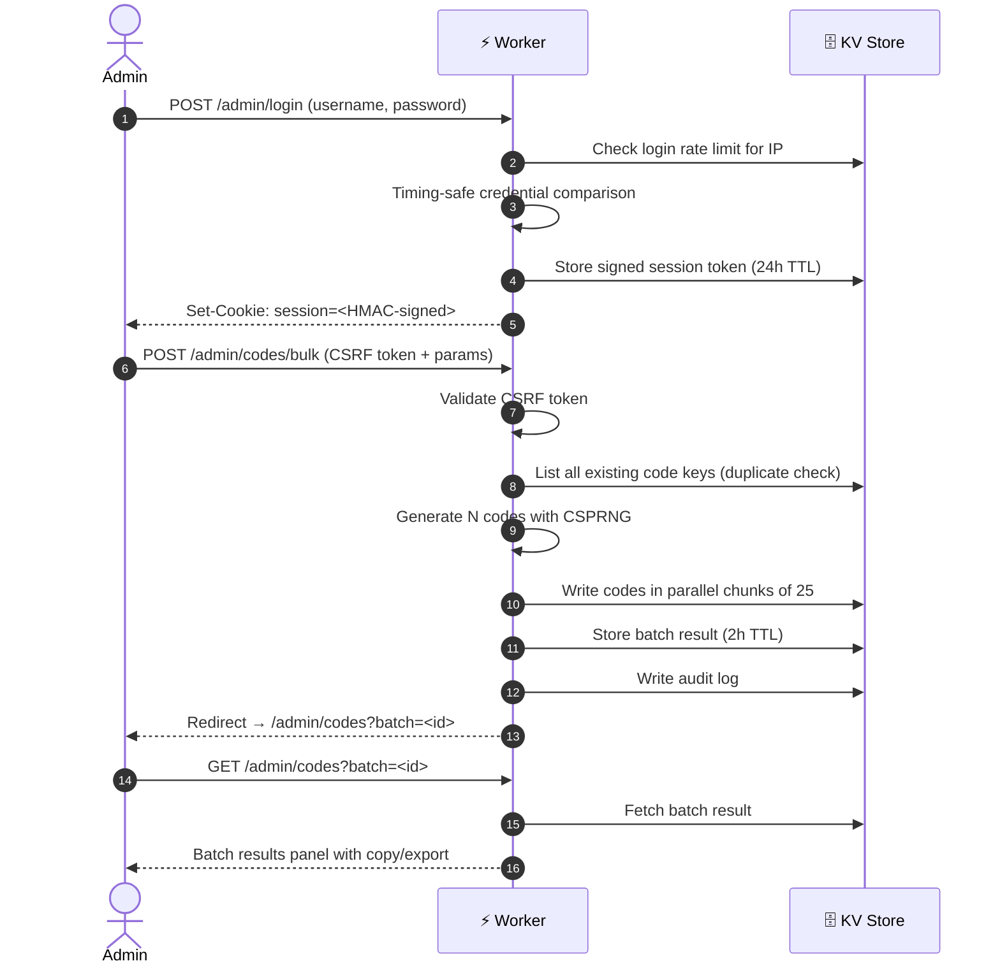
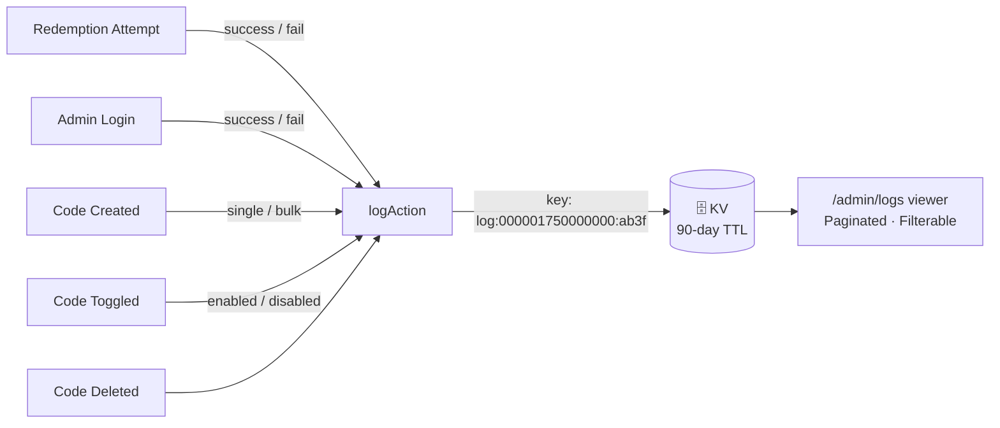

<div align="center">

# Canva Invite Manager

**A secure, serverless invitation code system for Canva Education classes — powered by Cloudflare Workers.**

[](https://opensource.org/licenses/Apache-2.0)
[](https://workers.cloudflare.com)
[](https://github.com/williethecool/canva-inviter)
[](CONTRIBUTING.md)
[](package.json)

Administrators generate cryptographically secure invitation codes and distribute them to students. Students redeem a code with their email address and are silently redirected server-side to the Canva class — the invite link is never exposed in source code or network responses.

[**Report a Bug**](https://github.com/williethecool/canva-inviter/issues/new?template=bug_report.md) · [**Request a Feature**](https://github.com/williethecool/canva-inviter/issues/new?template=feature_request.md)

</div>

---

## Table of Contents

- [Overview](#overview)
- [Features](#features)
- [Architecture](#architecture)
  - [System Diagram](#system-diagram)
  - [Public Redemption Flow](#public-redemption-flow)
  - [Admin Panel Flow](#admin-panel-flow)
  - [Logging System](#logging-system)
- [Project Structure](#project-structure)
- [Deployment](#deployment)
  - [Prerequisites](#prerequisites)
  - [Step 1 — Create a KV Namespace](#step-1--create-a-kv-namespace)
  - [Step 2 — Create the Worker](#step-2--create-the-worker)
  - [Step 3 — Bind KV to the Worker](#step-3--bind-kv-to-the-worker)
  - [Step 4 — Configure Environment Variables](#step-4--configure-environment-variables)
  - [Step 5 — Verify](#step-5--verify)
  - [Step 6 — Optional: Custom Domain](#step-6--optional-custom-domain)
- [Configuration](#configuration)
- [Usage](#usage)
  - [For Students](#for-students)
  - [For Administrators](#for-administrators)
- [Security](#security)
- [Logging](#logging)
- [Data Schema](#data-schema)
- [Roadmap](#roadmap)
- [Contributing](#contributing)
- [License](#license)
- [Disclaimer](#disclaimer)

---

## Overview

**Canva Invite Manager** solves a real classroom problem: sharing a Canva Education class invite link publicly creates a risk of unauthorised access. This system places a secure gating layer in front of that link using invitation codes, without requiring any backend server, database, or infrastructure beyond a free Cloudflare account.

The system has two surfaces:

| Surface | Audience | Path |
|---|---|---|
| **Redemption Page** | Students | `/` |
| **Admin Panel** | Instructors / Administrators | `/admin/*` |

**Public Redemption Page** — Students visit the Worker URL, enter their email address and the invitation code they received, and are immediately redirected to the Canva class. The Canva invite URL is never embedded in HTML, JavaScript, or any network response visible to the client. It exists only as an encrypted server-side environment variable.

**Admin Panel** — Administrators log in to a password-protected dashboard to generate codes (individually or in bulk batches of up to 2,000), set expiration dates and usage limits, export codes as `.txt` or `.csv`, view real-time usage statistics, disable or delete codes, and audit the full activity log.

---

## Features

### Code Generation
- 🔐 **Cryptographically secure** — uses `crypto.getRandomValues` (CSPRNG); no `Math.random()`
- 🔤 **Unambiguous character set** — excludes `0`, `O`, `1`, `I` to prevent misreading
- 🏷️ **Custom prefixes** — e.g. `EDU-ABCD1234`, `FALL25-XYZ9`
- 📦 **Bulk generation** — up to 2,000 codes per batch with guaranteed cross-batch uniqueness
- ⚙️ **Configurable** — length (4–16 chars), max uses (1–10,000), expiration date

### Code Management
- ✅ **Enable / disable** individual codes without deleting them
- 🗑️ **Delete** codes permanently
- 🔎 **Search and filter** by code text, status (active, disabled, expired, full)
- 📋 **Copy All / Copy Selected** — clipboard support with textarea fallback for all browsers
- ⬇️ **Export** batch or full library as `.txt` (one code per line) or `.csv` (`code,max_uses,expiration_date`)

### Security
- 🚫 **Rate limiting** — 5 redeem attempts / 15 min per IP; 10 login attempts / 15 min per IP
- 🕐 **Constant-time delay** — 150 ms fixed delay on all redemption failures prevents timing-based enumeration
- 🎭 **Generic error messages** — no information leakage about why a code failed
- 🔒 **Server-side redirect** — Canva URL is stored as an encrypted env var and used only in a `302` response header
- 🛡️ **CSRF protection** — per-session HMAC tokens validated on every admin POST
- 🔑 **Signed session cookies** — HMAC-SHA256, `HttpOnly`, `Secure`, `SameSite=Lax`
- 🧮 **Timing-safe credential comparison** — SHA-256 digest XOR prevents timing attacks on login

### Logging & Observability
- 📝 **Full audit trail** — every redemption attempt, admin login, and code lifecycle event is logged
- 🔍 **Filterable log viewer** — filter by action type, paginated 50 entries per page
- 🕵️ **Privacy-preserving** — codes are stored in logs as `AB****34` (never in full)
- 🗓️ **90-day retention** — logs auto-expire via KV TTL

### Infrastructure
- ⚡ **Zero cold starts** — Cloudflare Workers run at the edge with no spin-up delay
- 🌍 **Global deployment** — served from 300+ Cloudflare data centres automatically
- 💰 **Free tier friendly** — fits comfortably within Cloudflare's free Workers + KV quotas
- 📦 **Single file, zero dependencies** — paste one `.js` file into the Cloudflare dashboard

---

## Architecture

### System Diagram



### Public Redemption Flow



### Admin Panel Flow



### Logging System

Every significant event writes a log entry to KV under a time-padded key (`log:{timestamp}:{random}`), ensuring chronological ordering and preventing key collisions under concurrent load.



Log entries include: `action`, `email`, `code` (obfuscated), `ip`, `timestamp`, and contextual fields such as `reason`, `batch_id`, or `by`.

---

## Project Structure

```
canva-invite-manager/
├── worker.js               # Complete Cloudflare Worker (single file, zero deps)
├── README.md               # This file
├── LICENSE                 # Apache License 2.0
├── CONTRIBUTING.md         # Contributor guide
├── .github/
│   ├── ISSUE_TEMPLATE/
│   │   ├── bug_report.md
│   │   └── feature_request.md
│   └── PULL_REQUEST_TEMPLATE.md
└── docs/
    ├── deployment-guide.md # Step-by-step GUI deployment
    └── security.md         # Threat model and security decisions
```

> **There is no build step.** `worker.js` is deployed by pasting directly into the Cloudflare dashboard editor. No `npm install`, no bundler, no local tooling required.

---

## Deployment

### Prerequisites

- A [Cloudflare account](https://dash.cloudflare.com/sign-up) (free tier works)
- Your Canva Education class invite link (copy it from Canva before starting)

All steps below use the **Cloudflare Dashboard GUI only** — no CLI, no terminal.

---

### Step 1 — Create a KV Namespace

1. Log in to [dash.cloudflare.com](https://dash.cloudflare.com)
2. In the left sidebar → **Workers & Pages** → **KV**
3. Click **Create a namespace**
4. Name it exactly: `INVITE_KV`
5. Click **Add**
6. Copy the **Namespace ID** shown — you will need it in Step 3

---

### Step 2 — Create the Worker

1. **Workers & Pages** → **Overview** → **Create application**
2. Click **Create Worker**
3. Give it a name (e.g. `canva-invite-manager`)
4. Click **Deploy** (deploys a placeholder)
5. On the success screen, click **Edit code**
6. **Select all** placeholder code and **delete it**
7. **Paste** the entire contents of [`worker.js`](worker.js)
8. Click **Save and deploy**

---

### Step 3 — Bind KV to the Worker

1. From your Worker's page → **Settings** tab → **Variables**
2. Scroll to **KV Namespace Bindings** → **Add binding**

| Variable name | KV namespace |
|---|---|
| `INVITE_KV` | Select `INVITE_KV` from the dropdown |

3. Click **Save**

> ⚠️ The variable name must be `INVITE_KV` exactly — the Worker code references this binding by name.

---

### Step 4 — Configure Environment Variables

Still in **Settings → Variables → Environment Variables**, add the following. Toggle **Encrypt** on for every value.

| Variable | Description | Encrypt |
|---|---|---|
| `CANVA_INVITE_URL` | Your full Canva class invite link | ✅ |
| `ADMIN_USERNAME` | Admin panel username | ✅ |
| `ADMIN_PASSWORD` | Admin panel password (use a strong password) | ✅ |
| `SESSION_SECRET` | Random 64-character string for signing sessions | ✅ |

**Generating `SESSION_SECRET`** — paste this into your browser's DevTools console:

```javascript
Array.from(crypto.getRandomValues(new Uint8Array(32)))
  .map(b => b.toString(16).padStart(2, '0')).join('')
```

Copy the output (a 64-character hex string) and paste it as the `SESSION_SECRET` value.

Click **Save and deploy** after adding all four variables.

---

### Step 5 — Verify

1. Visit your Worker URL (format: `your-name.your-subdomain.workers.dev`)
2. You should see the **public code redemption page**
3. Navigate to `/admin/login` and sign in with your credentials
4. Create a test code under **Invite Codes** and redeem it at `/`
5. Confirm you are redirected to your Canva class

---

### Step 6 — Optional: Custom Domain

1. Your domain must be routed through Cloudflare (orange cloud ☁️ in DNS)
2. Worker → **Settings** → **Triggers** → **Custom Domains** → **Add Custom Domain**
3. Enter a subdomain, e.g. `invite.yourdomain.edu`
4. Cloudflare handles DNS and TLS automatically — no further configuration needed

---

## Configuration

All configuration is managed through Cloudflare environment variables. No config files are committed to the repository.

```bash
# ── Required ───────────────────────────────────────────────────────────────────
CANVA_INVITE_URL=https://www.canva.com/brand/join?token=...&referrer=team-invite
ADMIN_USERNAME=admin
ADMIN_PASSWORD=your-strong-password-here
SESSION_SECRET=a3f8c1d2e4b6...  # 64 hex chars, generated with crypto.getRandomValues

# ── KV Namespace Binding (set in Cloudflare Dashboard, not as env var) ─────────
# Variable name: INVITE_KV
# Namespace:     INVITE_KV  (created in Step 1)
```

**Tunable constants** (edit `worker.js` before deploying):

| Constant | Default | Description |
|---|---|---|
| `BULK_MAX` | `2000` | Maximum codes per bulk batch |
| `BULK_WARN_AT` | `200` | Show browser confirmation dialog at this count |
| `KV_WRITE_CHUNK` | `25` | Parallel KV writes per batch chunk |
| `SESSION_TTL_S` | `86400` | Admin session lifetime (seconds) |
| `BATCH_TTL_S` | `7200` | Batch results panel retention (seconds) |
| `RL_REDEEM_MAX` | `5` | Max redemption attempts per IP per window |
| `RL_REDEEM_WIN_S` | `900` | Redemption rate limit window (seconds) |
| `RL_LOGIN_MAX` | `10` | Max login attempts per IP per window |
| `RL_LOGIN_WIN_S` | `900` | Login rate limit window (seconds) |
| `LOG_PAGE` | `50` | Log entries per page |
| `CODE_PAGE` | `40` | Codes per page in admin table |

---

## Usage

### For Students

1. Obtain an invitation code from your instructor
2. Visit the class registration page (your Worker URL, e.g. `invite.school.edu`)
3. Enter your **email address** and **invitation code**
4. Click **Redeem & Join**
5. You will be instantly redirected to join the Canva Education class

If you see an error, check:
- The code was typed correctly (no spaces, correct capitalisation)
- The code has not already been used (single-use codes are the default)
- The code has not expired
- You have not exceeded the retry limit (wait 15 minutes if so)

---

### For Administrators

**Logging in**

Navigate to `/admin/login` and enter your administrator credentials.

---

**Creating a single code**

Go to **Invite Codes** → **Create Single Code**.

| Field | Description |
|---|---|
| Custom code | Leave blank to auto-generate, or enter a specific string (e.g. `TEACHER2025`) |
| Prefix | Optional prefix prepended to auto-generated codes (e.g. `EDU`) |
| Length | Total code length including prefix (4–16 characters) |
| Max uses | How many times the code can be redeemed (1–10,000) |
| Expiration | Optional date and time after which the code is rejected |

---

**Bulk generating codes**

Go to **Invite Codes** → **Bulk Generate Codes**.

After submission, a **Batch Results Panel** appears at the top of the page showing all generated codes. From this panel you can:

- **☑ Select All / ☐ Deselect All** — toggle checkboxes on every code
- **⎘ Copy All** — copy all codes in the batch to the clipboard (one per line)
- **⎘ Copy Selected** — copy only checked codes to the clipboard
- **⬇ TXT** — download the batch as a plain-text file
- **⬇ CSV** — download the batch as a CSV with columns `code`, `max_uses`, `expiration_date`
- Per-row **Copy** button — hover any code to reveal a one-click copy button

The batch panel remains visible for 2 hours after generation. The **✕ Dismiss** button hides it without deleting the codes.

---

**Managing existing codes**

The **All Codes** table supports:
- **Search** — filter by code text (prefix-matched)
- **Status filter chips** — All · Active · Disabled · Expired · Full
- **🔕 / ✔️** — toggle a code between disabled and enabled without deleting it
- **🗑️** — permanently delete a code (shows a confirmation dialog)
- **Export All** — download the complete code library as `.txt` or `.csv` from the top toolbar

---

**Viewing logs**

Navigate to **Logs** to see the full activity log, filterable by action type:

| Action | Meaning |
|---|---|
| `redeem_ok` | Successful code redemption |
| `redeem_fail` | Failed redemption attempt (invalid / expired / exhausted) |
| `redeem_rate_limited` | IP exceeded the rate limit |
| `admin_login_ok` | Successful admin login |
| `admin_login_fail` | Failed admin login attempt |
| `admin_create_code` | Single code created |
| `admin_bulk_create` | Bulk batch created |
| `admin_enable_code` | Code re-enabled |
| `admin_disable_code` | Code disabled |
| `admin_delete_code` | Code permanently deleted |

---

## Security

Canva Invite Manager was designed with defence-in-depth. The following controls are applied independently — no single bypass defeats the system.

### Rate Limiting

All rate limit counters are stored in KV with automatic TTL expiry. They cannot be reset by clearing cookies or changing user agents — the key is the client IP address as reported by Cloudflare (`CF-Connecting-IP`).

| Endpoint | Limit | Window |
|---|---|---|
| `POST /redeem` | 5 attempts | 15 minutes |
| `POST /admin/login` | 10 attempts | 15 minutes |

### Code Enumeration Protection

Multiple layered controls make it infeasible to enumerate valid codes:

- All failure paths return the **same generic error message** — there is no way to distinguish "code not found" from "code expired" from "code exhausted"
- A **fixed 150 ms server-side delay** is added to all redemption failures, making timing-based enumeration impractical even if rate limiting is bypassed at the network layer
- Codes use a **32-character unambiguous alphabet** — an 8-character code has ~1.1 trillion possible values

### Server-Side Redirect

The Canva invite URL is stored as an encrypted Cloudflare environment variable. It is:
- Never written to any HTML page
- Never included in any JavaScript
- Never included in any log entry
- Transmitted to the client only as a `Location` header in a `302 Found` response

A student who inspects the page source, the network tab, or the KV store will find no trace of the URL.

### Admin Authentication

| Control | Implementation |
|---|---|
| Password storage | Cloudflare encrypted environment variable (not in code or KV) |
| Credential comparison | SHA-256 digest XOR — timing-safe, not short-circuit |
| Session integrity | HMAC-SHA256 signed token; verified on every request |
| Session storage | KV with 24-hour TTL; deleted on logout |
| Cookie flags | `HttpOnly`, `Secure`, `SameSite=Lax` |
| CSRF protection | Per-session random token validated on every admin `POST` |

### Secure Code Generation

```
CHARSET = "ABCDEFGHJKLMNPQRSTUVWXYZ23456789"
         (32 characters; excludes 0, O, 1, I to prevent visual ambiguity)

entropy = log₂(32ⁿ) bits  for code length n

n=6  →  30 bits
n=8  →  40 bits   ← default
n=10 →  50 bits
n=12 →  60 bits
```

All randomness comes from `crypto.getRandomValues()` — the Web Cryptography API's CSPRNG, available natively in the Cloudflare Workers runtime.

---

## Logging

Every logged entry is a JSON object stored in KV under a key of the form:

```
log:{zero-padded-unix-ms}:{4-byte-hex-random}
```

The zero-padded timestamp guarantees chronological ordering when listing keys lexicographically. The random suffix prevents write collisions during concurrent requests.

**Example log entries:**

```jsonc
// Successful redemption
{
  "action":    "redeem_ok",
  "email":     "student@school.edu",
  "code":      "ED****34",          // always obfuscated in logs
  "ip":        "203.0.113.42",
  "timestamp": "2025-09-01T10:22:14.381Z"
}

// Failed redemption
{
  "action":    "redeem_fail",
  "reason":    "expired",           // not shown to the student
  "email":     "student@school.edu",
  "code":      "FA****91",
  "ip":        "203.0.113.42",
  "timestamp": "2025-09-01T10:22:14.531Z"
}

// Bulk batch created
{
  "action":    "admin_bulk_create",
  "count":     250,
  "batch_id":  "a3f8c1d2e4b6...",
  "by":        "admin",
  "timestamp": "2025-09-01T09:00:00.000Z"
}
```

Log entries are retained for **90 days** via KV TTL and then automatically deleted.

---

## Data Schema

### Invitation Code — `code:{CODE}`

```typescript
{
  created_at:      string;           // ISO 8601
  expiration_date: string | null;    // ISO 8601, or null for no expiry
  max_uses:        number;           // 1–10,000
  current_uses:    number;           // incremented on each successful redemption
  enabled:         boolean;          // false = disabled by admin
  prefix:          string;           // optional prefix used during generation
  batch_generated: boolean;          // true if created via bulk endpoint
  redemptions:     Array<{
    email:         string;
    ip:            string;
    redeemed_at:   string;           // ISO 8601
  }>;
}
```

### Batch Result — `batch:{id}` *(2-hour TTL)*

```typescript
{
  batch_id:     string;             // matches the KV key suffix
  generated_at: string;             // ISO 8601
  count:        number;
  params: {
    prefix:          string;
    length:          number;
    max_uses:        number;
    expiration_date: string | null;
  };
  codes: string[];                  // full list of generated codes
}
```

### Session — `session:{token}` *(24-hour TTL)*

```typescript
{
  token:      string;               // random hex token (signing key)
  csrf_token: string;               // random hex token (per-session CSRF)
  expires_at: number;               // Unix ms
  username:   string;
}
```

### Log Entry — `log:{ts}:{rand}` *(90-day TTL)*

```typescript
{
  action:    string;                // see action labels in Usage section
  timestamp: string;               // ISO 8601
  email?:    string;               // redemption events
  code?:     string;               // obfuscated (AB****34)
  ip?:       string;
  reason?:   string;               // failure reason (server-side only)
  by?:       string;               // admin username for admin actions
  count?:    number;               // bulk create
  batch_id?: string;               // bulk create
}
```

---

## Roadmap

The following enhancements are being considered for future releases. Contributions welcome — see [Contributing](#contributing).

| Priority | Feature | Notes |
|---|---|---|
| 🔥 High | **Durable Objects backend** | Replace KV with Durable Objects for strongly consistent writes under concurrent load |
| 🔥 High | **Admin password hashing** | Store a bcrypt/scrypt hash in KV rather than comparing to env var |
| 🟡 Medium | **Per-code redemption email log** | Email notification to admin on each successful redemption |
| 🟡 Medium | **Bulk disable by prefix** | Disable or delete all codes sharing a prefix in one action |
| 🟡 Medium | **Code expiry warnings** | Dashboard callout when codes expire within N days |
| 🟢 Low | **Multi-class support** | Associate codes with different Canva invite URLs |
| 🟢 Low | **Redemption analytics** | Charts on the dashboard showing redemptions over time |
| 🟢 Low | **Wrangler CLI support** | `wrangler.toml` + `wrangler deploy` workflow alongside GUI deployment |
| 🟢 Low | **Webhook on redemption** | `POST` to a configurable URL when a code is redeemed |

---

## Contributing

Contributions are warmly welcomed. This project follows a standard GitHub fork-and-PR workflow.

### Getting Started

1. **Fork** the repository and clone your fork:
   ```bash
   git clone https://github.com/your-username/canva-invite-manager.git
   cd canva-invite-manager
   ```

2. **Create a branch** for your change:
   ```bash
   git checkout -b feat/my-new-feature
   # or
   git checkout -b fix/issue-123-rate-limit-bug
   ```

3. **Make your changes** to `worker.js`

4. **Test locally** using [Wrangler](https://developers.cloudflare.com/workers/wrangler/):
   ```bash
   npm install -g wrangler
   wrangler dev --local
   ```
   Set local environment variables in a `.dev.vars` file (never commit this file):
   ```bash
   CANVA_INVITE_URL=https://canva.com/...
   ADMIN_USERNAME=admin
   ADMIN_PASSWORD=testpassword
   SESSION_SECRET=0000000000000000000000000000000000000000000000000000000000000000
   ```

5. **Open a pull request** against the `main` branch

---

### Branching Convention

| Branch prefix | Purpose |
|---|---|
| `feat/` | New features |
| `fix/` | Bug fixes |
| `docs/` | Documentation changes only |
| `refactor/` | Code restructuring without behaviour change |
| `security/` | Security improvements |
| `chore/` | Dependency updates, tooling, CI |

---

### Commit Message Standard

This project follows the [Conventional Commits](https://www.conventionalcommits.org/) specification:

```
<type>(<scope>): <short description>

[optional body]

[optional footer: Fixes #123]
```

**Examples:**

```bash
feat(bulk): add server-side CSV export endpoint
fix(auth): correct CSRF token comparison timing
docs(readme): update deployment screenshots
security(ratelimit): lower redeem window to 10 minutes
```

Valid types: `feat`, `fix`, `docs`, `refactor`, `security`, `test`, `chore`

---

### Opening Issues

Before opening an issue, please:
- Search [existing issues](https://github.com/your-org/canva-invite-manager/issues) to avoid duplicates
- Use the provided issue templates (bug report / feature request)
- For **security vulnerabilities**, do **not** open a public issue — see [Security Policy](docs/security.md) for responsible disclosure instructions

---

### Code Style

- **No external dependencies** — the single-file, zero-dependency constraint is a feature, not a limitation
- **Module syntax** — use `export default`, `async/await`, and ES2022+ features supported by the Workers runtime
- **Descriptive names** — prefer `handleBulkCreate` over `bulkCreate`, `isExpired` over `expired`
- **Comment intent, not mechanics** — explain *why*, not *what*
- **HTML in template literals** — keep HTML generation co-located with the handler that uses it; use the `e()` escaping helper on all user-supplied values
- **Security first** — any change touching auth, code validation, or session handling must include a brief threat model comment

---

### Pull Request Checklist

Before requesting review, confirm:

- [ ] The Worker file remains a single self-contained `.js` file
- [ ] No external `npm` packages or `import` statements from URLs are introduced
- [ ] All user inputs are sanitised with `sanitize()` and validated before use
- [ ] HTML template output uses `e()` on all interpolated values
- [ ] Any new admin `POST` endpoint validates the CSRF token via `validateCSRF()`
- [ ] New features are covered by a brief description in the PR body
- [ ] `CHANGELOG.md` (if present) is updated

---

## License

Copyright 2025 Canva Invite Manager Contributors

Licensed under the **Apache License, Version 2.0**. You may not use this project except in compliance with the License.

```
Licensed under the Apache License, Version 2.0 (the "License");
you may not use this file except in compliance with the License.
You may obtain a copy of the License at

    https://www.apache.org/licenses/LICENSE-2.0

Unless required by applicable law or agreed to in writing, software
distributed under the License is distributed on an "AS IS" BASIS,
WITHOUT WARRANTIES OR CONDITIONS OF ANY KIND, either express or implied.
See the License for the specific language governing permissions and
limitations under the License.
```

See the [`LICENSE`](LICENSE) file for the full license text.

---

## Disclaimer

> **Canva Invite Manager is an independent open-source project.**
>
> This project is **not affiliated with, endorsed by, sponsored by, or officially connected to Canva Pty Ltd** in any way. "Canva" is a registered trademark of Canva Pty Ltd. All product names, logos, and trademarks mentioned are the property of their respective owners.
>
> This software is provided as-is for educational and administrative convenience. The authors make no warranties about the suitability of this software for any purpose and accept no liability for misuse, data loss, or unauthorised access resulting from its deployment.
>
> Administrators are solely responsible for the security of their deployment, the management of their invitation codes, and compliance with their institution's acceptable use policies and any applicable privacy regulations (FERPA, GDPR, etc.) when processing student email addresses.

---

<div align="center">

Built with ☁️ on [Cloudflare Workers](https://workers.cloudflare.com) · Licensed under [Apache 2.0](LICENSE) · [Contribute](CONTRIBUTING.md)

</div>
